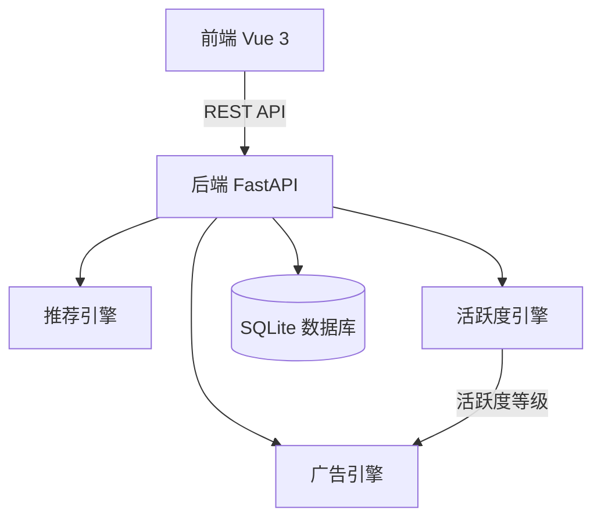
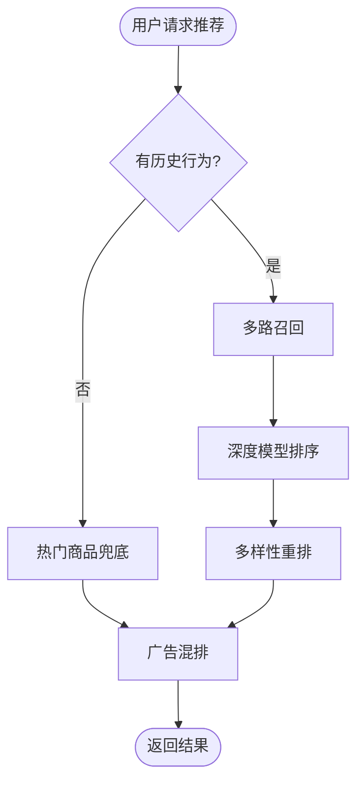
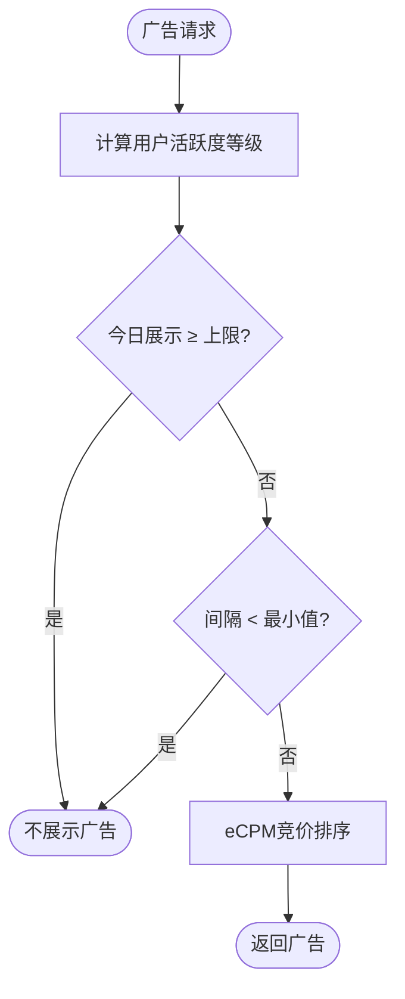
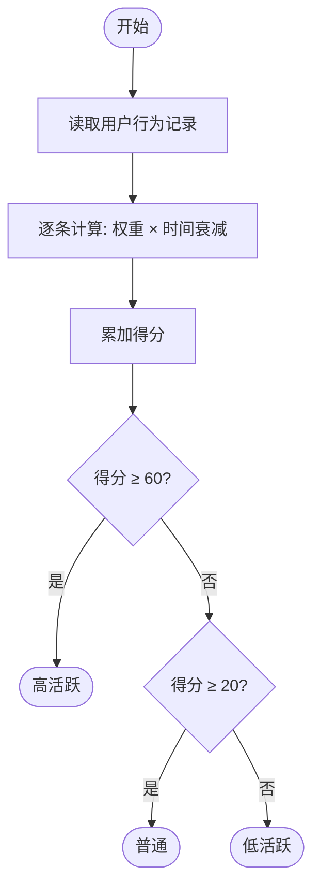

# 论文流程图（Mermaid 源码）

简洁清晰版本，每张图控制在5-8个节点，A4打印清晰可读。
用 Visio 按以下逻辑绘制，开始/结束用椭圆，处理用矩形，判断用菱形。

---

## 图3-1 系统整体架构图

---

## 图3-2 推荐流程图

---

## 图3-3 广告频控流程图

---

## 图4-1 活跃度评分流程图

---

## 使用说明

1. 复制 Mermaid 代码到 https://mermaid.live/ 预览
2. 在 Visio 中按逻辑绘制：椭圆=开始/结束，矩形=处理，菱形=判断
3. 导出为图片插入 Word 对应占位位置
4. 图片宽度建议12-14cm，居中排列
