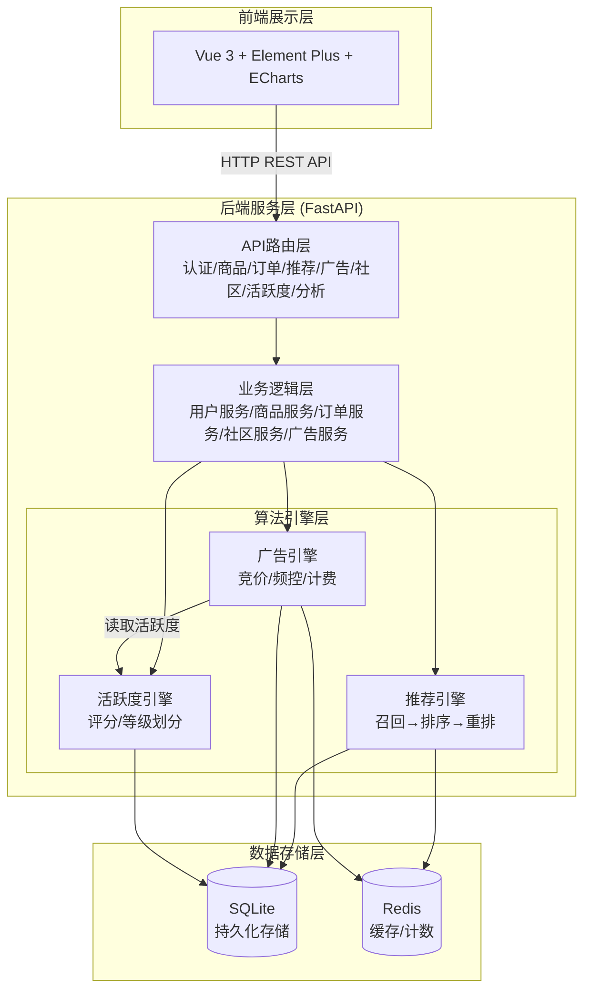
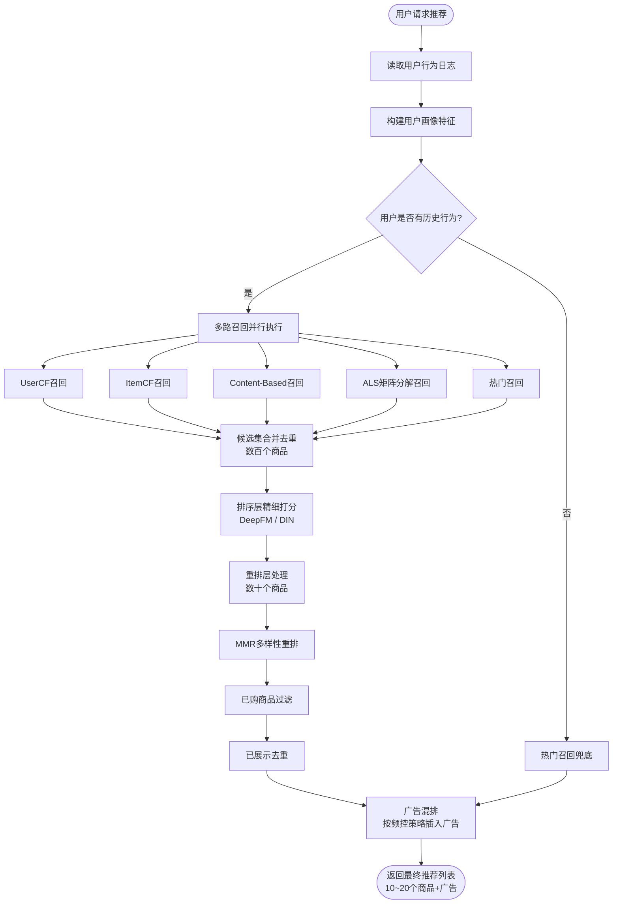
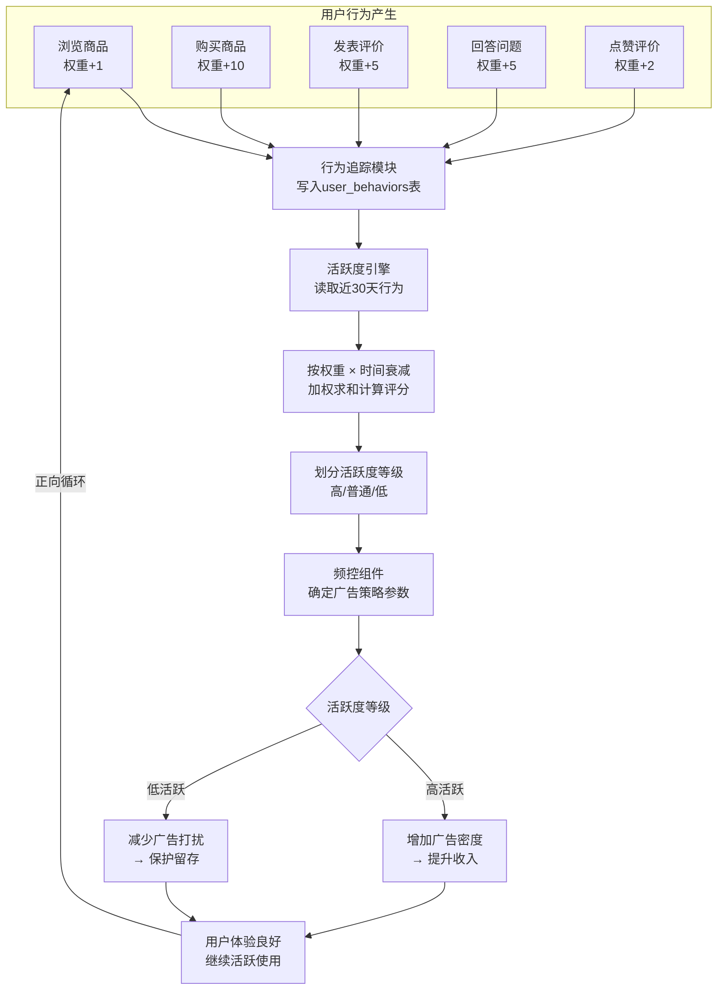
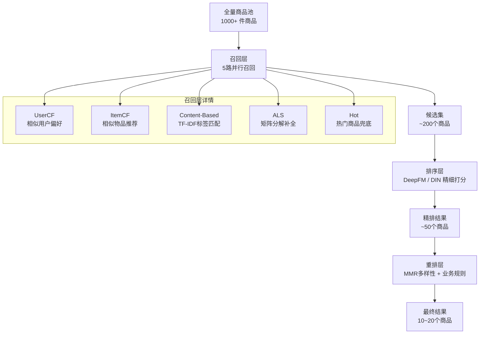

# 论文流程图（Mermaid 源码）

以下为论文中需要插入的流程图的标准 Mermaid 格式源码。请使用 Visio 按照 Mermaid 逻辑绘制规范流程图，然后插入到 Word 文档对应的占位位置。

流程图规范要求：
- 开始/结束：圆角矩形（椭圆形）
- 处理步骤：矩形
- 判断/分支：菱形
- 箭头方向：从上到下或从左到右
- 连接线带箭头，分支标注条件文字

---

## 图3-1 系统整体架构图



---

## 图3-2 推荐引擎数据流程图



---

## 图3-3 广告投放与频控流程图

```mermaid
flowchart TB
    Start([页面请求广告]) --> A[获取当前用户信息]
    A --> B[查询用户行为日志]
    B --> C[计算活跃度评分<br/>score = Σ weight × decay]
    C --> D[划分活跃度等级]
    D --> E{等级判定}
    E -->|score ≥ 60| F1[高活跃<br/>每页3条/间隔60s/日限50]
    E -->|20 ≤ score < 60| F2[普通<br/>每页2条/间隔120s/日限30]
    E -->|score < 20| F3[低活跃<br/>每页1条/间隔300s/日限10]
    
    F1 --> G[获取频控参数]
    F2 --> G
    F3 --> G
    
    G --> H{今日展示数 ≥ 日上限?}
    H -->|是| X([返回空广告列表])
    H -->|否| I{距上次展示 < 最小间隔?}
    I -->|是| X
    I -->|否| J[查询active状态广告]
    J --> K[计算eCPM排序<br/>eCPM = bid × pCTR × 1000]
    K --> L[截取Top-N条广告<br/>N = min(每页数, 日限-已展示)]
    L --> M[返回广告列表]
    M --> N[前端展示广告]
    N --> O{用户点击?}
    O -->|是| P[上报click事件<br/>CPC扣费]
    O -->|否| Q[上报show事件<br/>CPM扣费]
    P --> R{预算是否耗尽?}
    Q --> R
    R -->|是| S[广告状态→exhausted]
    R -->|否| End([流程结束])
    S --> End
```

---

## 图3-4 活跃度反馈闭环流程图



---

## 图4-1 多阶段推荐漏斗架构图



---

## 图4-2 频控组件判断流程图

```mermaid
flowchart TB
    Start([开始频控判断]) --> A[输入: user_id, activity_level,<br/>today_count, last_shown_ts]
    A --> B[根据activity_level<br/>获取FrequencyPolicy]
    B --> C{today_count ≥ daily_cap?}
    C -->|是| D([返回: 不允许<br/>reason=daily_cap_reached])
    C -->|否| E[计算时间差<br/>elapsed = now - last_shown_ts]
    E --> F{elapsed < min_interval_sec?}
    F -->|是| G([返回: 不允许<br/>reason=min_interval_not_met])
    F -->|否| H[计算可展示数量<br/>max_ads = min(ads_per_page,<br/>daily_cap - today_count)]
    H --> I([返回: 允许<br/>max_ads=N])
```

---

## 图4-3 活跃度评分计算流程图

```mermaid
flowchart TB
    Start([开始计算活跃度]) --> A[输入: 用户行为列表]
    A --> B{行为列表是否为空?}
    B -->|是| C([返回 score = 0.0])
    B -->|否| D[初始化 score = 0.0]
    D --> E[遍历每条行为记录]
    E --> F[获取行为权重<br/>weight = BEHAVIOR_WEIGHTS.get(type)]
    F --> G[计算时间差<br/>days_ago = (now - created_at) / 86400]
    G --> H[计算衰减因子<br/>decay = e^(-0.1 × days_ago)]
    H --> I[累加得分<br/>score += weight × decay]
    I --> J{还有更多行为?}
    J -->|是| E
    J -->|否| K[封顶处理<br/>score = min(100, score)]
    K --> L[等级划分]
    L --> M{score ≥ 60?}
    M -->|是| N([返回 high])
    M -->|否| O{score ≥ 20?}
    O -->|是| P([返回 normal])
    O -->|否| Q([返回 low])
```

---

## 使用说明

1. 将以上 Mermaid 代码复制到 [Mermaid Live Editor](https://mermaid.live/) 中预览
2. 参照 Mermaid 图的逻辑结构，在 Visio 中绘制标准流程图
3. 流程图规范：开始/结束用椭圆形，处理步骤用矩形，判断用菱形，连接线带箭头
4. 导出为图片（PNG/EMF），插入到 Word 文档中对应的【此处插入流程图】占位位置
5. 在图片下方添加图号和标题（如"图3-1 系统整体架构图"）
