# 论文插图说明

共12张图，包含流程图（Mermaid源码，用Visio绘制）和截图（运行系统后截取）。

---

## 流程图（用Visio绘制）

### 图2-1 DeepFM模型结构图

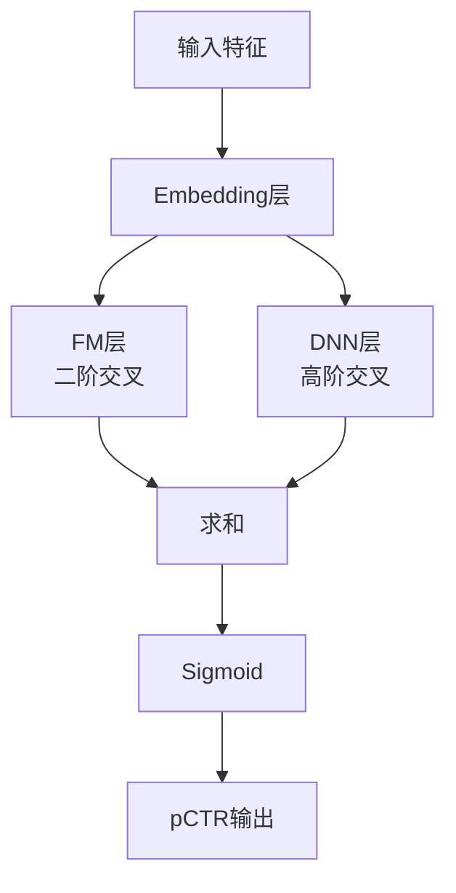
```mermaid
graph TB
    A[输入特征] --> B[Embedding层]
    B --> C[FM层<br/>二阶交叉]
    B --> D[DNN层<br/>高阶交叉]
    C --> E[求和]
    D --> E
    E --> F[Sigmoid]
    F --> G[pCTR输出]
```

---

### 图3-1 系统用例图

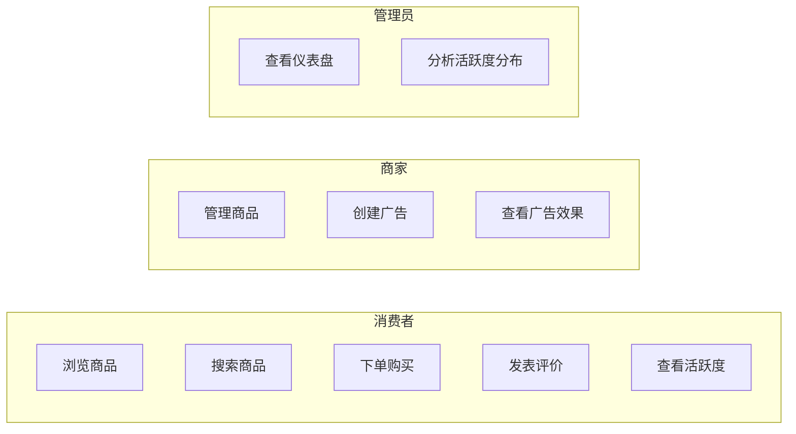
```mermaid
graph LR
    subgraph 消费者
        A1[浏览商品]
        A2[搜索商品]
        A3[下单购买]
        A4[发表评价]
        A5[查看活跃度]
    end
    subgraph 商家
        B1[管理商品]
        B2[创建广告]
        B3[查看广告效果]
    end
    subgraph 管理员
        C1[查看仪表盘]
        C2[分析活跃度分布]
    end
```

---

### 图3-2 系统整体架构图

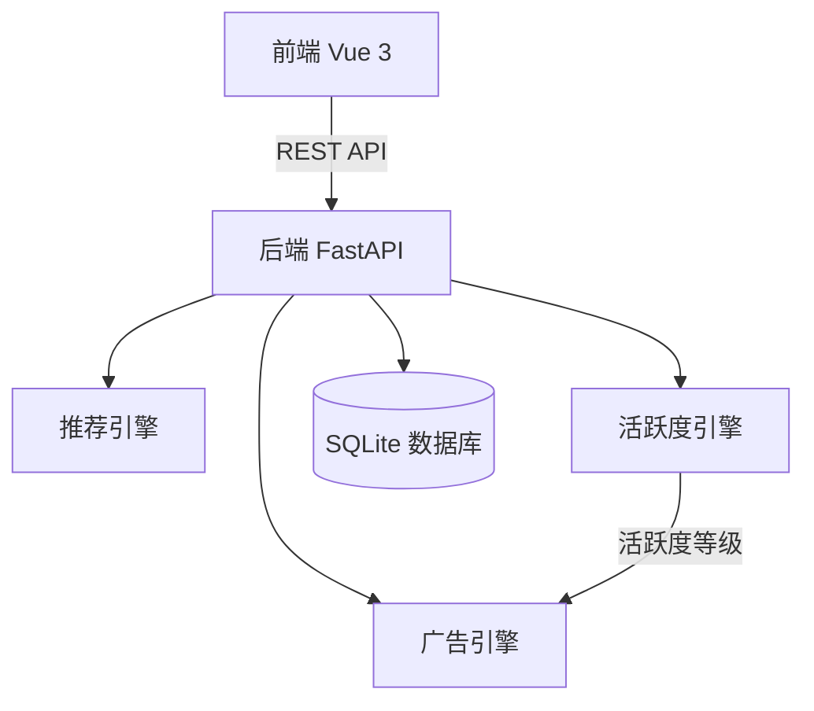
```mermaid
graph TB
    A[前端 Vue 3] -->|REST API| B[后端 FastAPI]
    B --> C[推荐引擎]
    B --> D[广告引擎]
    B --> E[活跃度引擎]
    E -->|活跃度等级| D
    B --> F[(SQLite 数据库)]
```

---

### 图3-3 推荐流程图

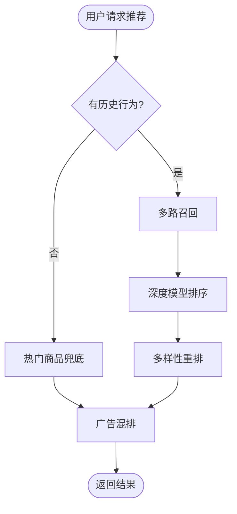
```mermaid
flowchart TB
    A([用户请求推荐]) --> B{有历史行为?}
    B -->|否| C[热门商品兜底]
    B -->|是| D[多路召回]
    D --> E[深度模型排序]
    E --> F[多样性重排]
    C --> G[广告混排]
    F --> G
    G --> H([返回结果])
```

---

### 图3-4 广告频控流程图

```mermaid
flowchart TB
    A([广告请求]) --> B[计算用户活跃度等级]
    B --> C{今日展示 ≥ 上限?}
    C -->|是| D([不展示广告])
    C -->|否| E{间隔 < 最小值?}
    E -->|是| D
    E -->|否| F[eCPM竞价排序]
    F --> G([返回广告])
```

---

### 图3-5 数据库E-R关系图

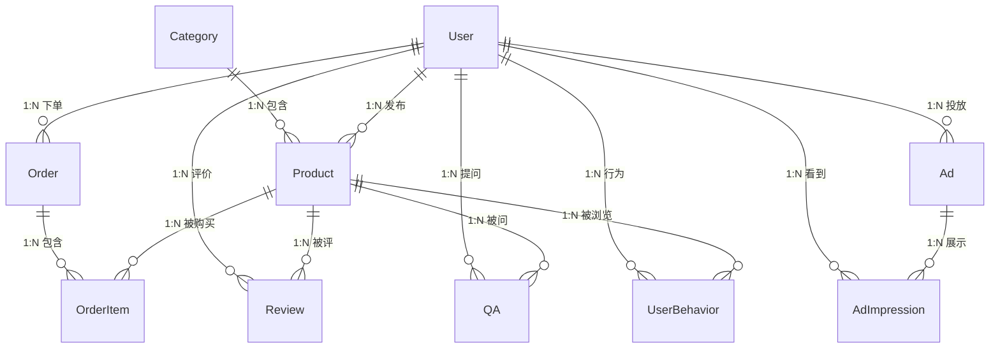
```mermaid
erDiagram
    User ||--o{ Order : "1:N 下单"
    User ||--o{ Review : "1:N 评价"
    User ||--o{ QA : "1:N 提问"
    User ||--o{ UserBehavior : "1:N 行为"
    User ||--o{ Ad : "1:N 投放"
    User ||--o{ AdImpression : "1:N 看到"
    Category ||--o{ Product : "1:N 包含"
    User ||--o{ Product : "1:N 发布"
    Product ||--o{ Review : "1:N 被评"
    Product ||--o{ QA : "1:N 被问"
    Product ||--o{ UserBehavior : "1:N 被浏览"
    Order ||--o{ OrderItem : "1:N 包含"
    Product ||--o{ OrderItem : "1:N 被购买"
    Ad ||--o{ AdImpression : "1:N 展示"
```

注：Order 与 Product 通过 OrderItem 构成 N:N（多对多）关系

---

### 图4-1 活跃度评分流程图

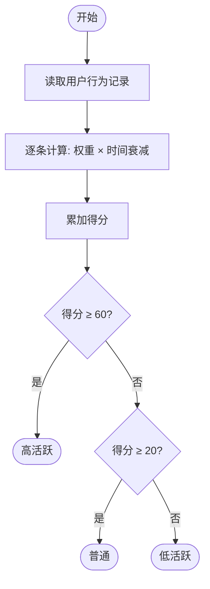
```mermaid
flowchart TB
    A([开始]) --> B[读取用户行为记录]
    B --> C[逐条计算: 权重 × 时间衰减]
    C --> D[累加得分]
    D --> E{得分 ≥ 60?}
    E -->|是| F([高活跃])
    E -->|否| G{得分 ≥ 20?}
    G -->|是| H([普通])
    G -->|否| I([低活跃])
```

---

### 图5-2 推荐引擎核心类图

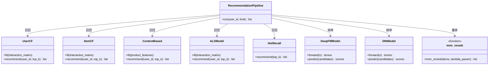
```mermaid
classDiagram
    class RecommendationPipeline {
        +run(user_id, limit) list
    }
    class UserCF {
        +fit(interaction_matrix)
        +recommend(user_id, top_k) list
    }
    class ItemCF {
        +fit(interaction_matrix)
        +recommend(user_id, top_k) list
    }
    class ContentBased {
        +fit(product_features)
        +recommend(user_id, top_k) list
    }
    class ALSModel {
        +fit(interaction_matrix)
        +recommend(user_id, top_k) list
    }
    class HotRecall {
        +recommend(top_k) list
    }
    class DeepFMModel {
        +forward(x) tensor
        +predict(candidates) scores
    }
    class DINModel {
        +forward(x) tensor
        +predict(candidates) scores
    }
    class mmr_rerank {
        <<function>>
        +mmr_rerank(items, lambda_param) list
    }
    RecommendationPipeline --> UserCF : 召回
    RecommendationPipeline --> ItemCF : 召回
    RecommendationPipeline --> ContentBased : 召回
    RecommendationPipeline --> ALSModel : 召回
    RecommendationPipeline --> HotRecall : 召回
    RecommendationPipeline --> DeepFMModel : 排序
    RecommendationPipeline --> DINModel : 排序
    RecommendationPipeline --> mmr_rerank : 重排
```

---

### 图5-3 个性化推荐请求时序图

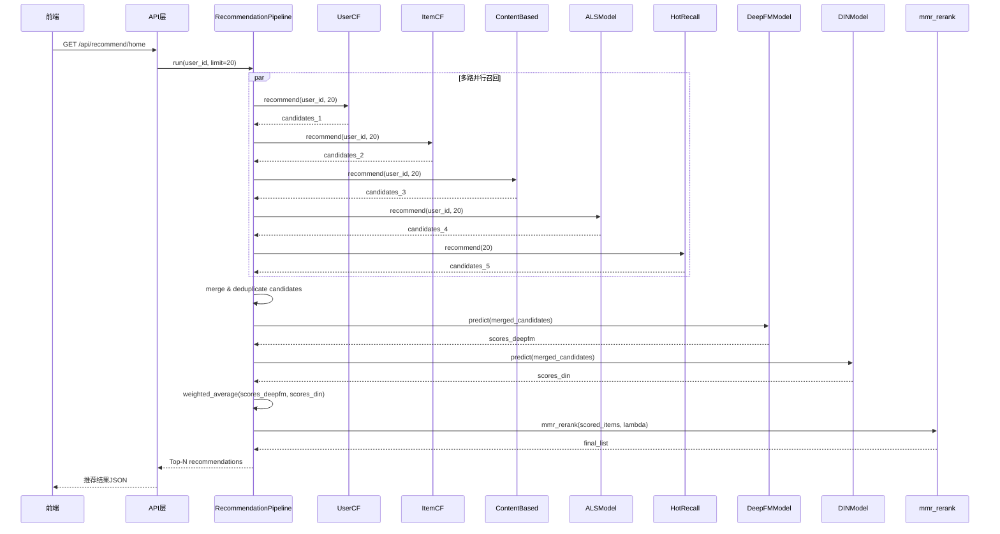
```mermaid
sequenceDiagram
    participant 前端
    participant API as API层
    participant Pipeline as RecommendationPipeline
    participant UCF as UserCF
    participant ICF as ItemCF
    participant CB as ContentBased
    participant ALS as ALSModel
    participant Hot as HotRecall
    participant DFM as DeepFMModel
    participant DIN as DINModel
    participant MMR as mmr_rerank

    前端->>API: GET /api/recommend/home
    API->>Pipeline: run(user_id, limit=20)
    par 多路并行召回
        Pipeline->>UCF: recommend(user_id, 20)
        UCF-->>Pipeline: candidates_1
        Pipeline->>ICF: recommend(user_id, 20)
        ICF-->>Pipeline: candidates_2
        Pipeline->>CB: recommend(user_id, 20)
        CB-->>Pipeline: candidates_3
        Pipeline->>ALS: recommend(user_id, 20)
        ALS-->>Pipeline: candidates_4
        Pipeline->>Hot: recommend(20)
        Hot-->>Pipeline: candidates_5
    end
    Pipeline->>Pipeline: merge & deduplicate candidates
    Pipeline->>DFM: predict(merged_candidates)
    DFM-->>Pipeline: scores_deepfm
    Pipeline->>DIN: predict(merged_candidates)
    DIN-->>Pipeline: scores_din
    Pipeline->>Pipeline: weighted_average(scores_deepfm, scores_din)
    Pipeline->>MMR: mmr_rerank(scored_items, lambda)
    MMR-->>Pipeline: final_list
    Pipeline-->>API: Top-N recommendations
    API-->>前端: 推荐结果JSON
```

---

### 图5-4 广告引擎类图

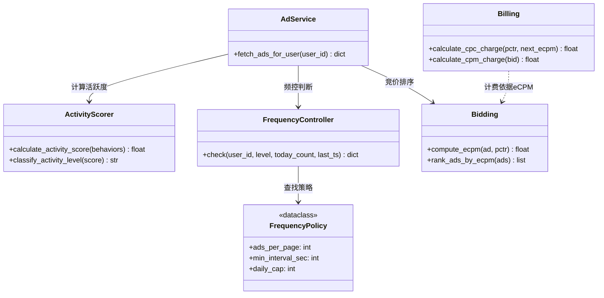
```mermaid
classDiagram
    class AdService {
        +fetch_ads_for_user(user_id) dict
    }
    class ActivityScorer {
        +calculate_activity_score(behaviors) float
        +classify_activity_level(score) str
    }
    class FrequencyController {
        +check(user_id, level, today_count, last_ts) dict
    }
    class FrequencyPolicy {
        <<dataclass>>
        +ads_per_page: int
        +min_interval_sec: int
        +daily_cap: int
    }
    class Bidding {
        +compute_ecpm(ad, pctr) float
        +rank_ads_by_ecpm(ads) list
    }
    class Billing {
        +calculate_cpc_charge(pctr, next_ecpm) float
        +calculate_cpm_charge(bid) float
    }
    AdService --> ActivityScorer : 计算活跃度
    AdService --> FrequencyController : 频控判断
    AdService --> Bidding : 竞价排序
    FrequencyController --> FrequencyPolicy : 查找策略
    Billing ..> Bidding : 计费依据eCPM
```

---

### 图5-5 广告获取接口时序图

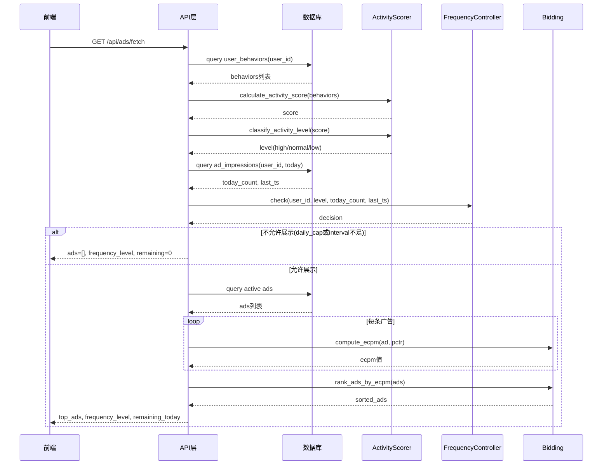
```mermaid
sequenceDiagram
    participant 前端
    participant API as API层
    participant DB as 数据库
    participant AS as ActivityScorer
    participant FC as FrequencyController
    participant BD as Bidding

    前端->>API: GET /api/ads/fetch
    API->>DB: query user_behaviors(user_id)
    DB-->>API: behaviors列表
    API->>AS: calculate_activity_score(behaviors)
    AS-->>API: score
    API->>AS: classify_activity_level(score)
    AS-->>API: level(high/normal/low)
    API->>DB: query ad_impressions(user_id, today)
    DB-->>API: today_count, last_ts
    API->>FC: check(user_id, level, today_count, last_ts)
    FC-->>API: decision
    alt 不允许展示(daily_cap或interval不足)
        API-->>前端: ads=[], frequency_level, remaining=0
    else 允许展示
        API->>DB: query active ads
        DB-->>API: ads列表
        loop 每条广告
            API->>BD: compute_ecpm(ad, pctr)
            BD-->>API: ecpm值
        end
        API->>BD: rank_ads_by_ecpm(ads)
        BD-->>API: sorted_ads
        API-->>前端: top_ads, frequency_level, remaining_today
    end
```

---

### 图5-6 行为追踪与活跃度反馈时序图

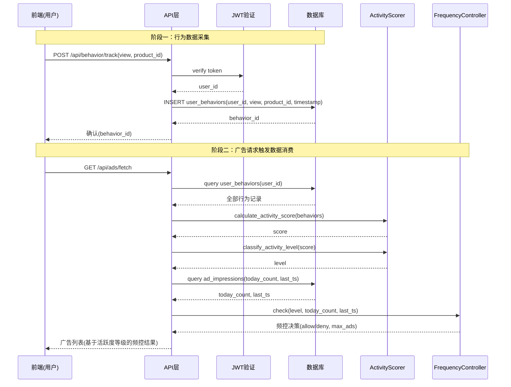
```mermaid
sequenceDiagram
    participant 用户 as 前端(用户)
    participant API as API层
    participant JWT as JWT验证
    participant DB as 数据库
    participant AS as ActivityScorer
    participant FC as FrequencyController

    Note over 用户, DB: 阶段一：行为数据采集
    用户->>API: POST /api/behavior/track(view, product_id)
    API->>JWT: verify token
    JWT-->>API: user_id
    API->>DB: INSERT user_behaviors(user_id, view, product_id, timestamp)
    DB-->>API: behavior_id
    API-->>用户: 确认(behavior_id)

    Note over 用户, FC: 阶段二：广告请求触发数据消费
    用户->>API: GET /api/ads/fetch
    API->>DB: query user_behaviors(user_id)
    DB-->>API: 全部行为记录
    API->>AS: calculate_activity_score(behaviors)
    AS-->>API: score
    API->>AS: classify_activity_level(score)
    AS-->>API: level
    API->>DB: query ad_impressions(today_count, last_ts)
    DB-->>API: today_count, last_ts
    API->>FC: check(level, today_count, last_ts)
    FC-->>API: 频控决策(allow/deny, max_ads)
    API-->>用户: 广告列表(基于活跃度等级的频控结果)
```

---

## 截图（运行系统后截取）

以下图片需要启动前后端系统，在浏览器中截取：

### 图A.1 系统首页界面截图
- 启动后端：`cd backend && uvicorn app.main:app --port 8000`
- 启动前端：`cd frontend && npm run dev`
- 登录账号 user_0 / user123
- 在浏览器中截取首页，包含推荐商品流和穿插的广告卡片

### 图A.2 商品详情页界面截图
- 点击任意商品进入详情页
- 截图包含：商品信息、价格、评价区域、问答区域、广告推荐区

### 图A.4 管理后台数据分析界面截图
- 登录管理员账号 admin / admin123
- 进入 /admin 页面
- 截图包含：统计卡片、活跃度饼图、广告效果排行图、频控策略图

### 图A.6 单元测试执行结果截图
- 运行：`cd backend && python -m pytest tests/ -v --tb=short`
- 截取终端输出，显示测试用例列表和 "77 passed, 4 skipped"

### 图A.7 集成测试执行结果截图
- 运行：`cd backend && python -m pytest tests/test_integration.py -v`
- 截取终端输出，显示6个集成测试全部通过

---

## 使用说明

1. 流程图：复制Mermaid代码到 https://mermaid.live/ 预览，然后在Visio中按逻辑绘制
2. 截图：启动系统后在浏览器/终端中截取，建议宽度12-14cm
3. 全部图片居中排列，图题在图片下方
4. 图序号格式："图X-Y 名称"
