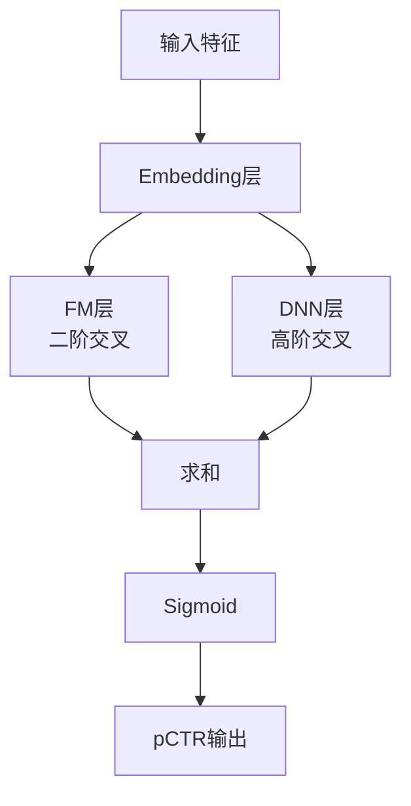
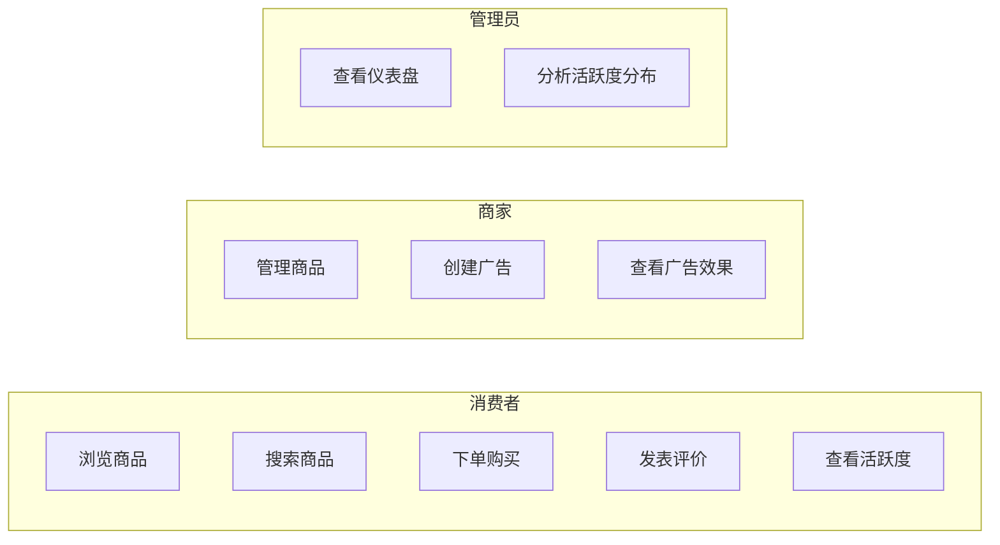
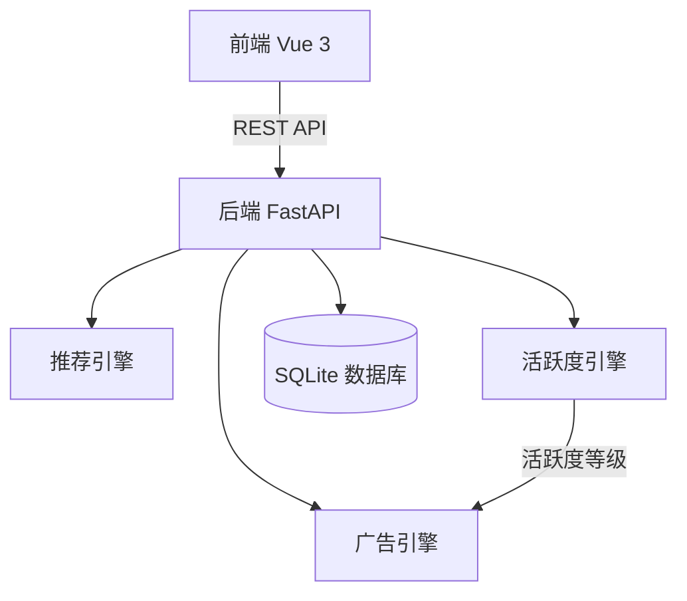
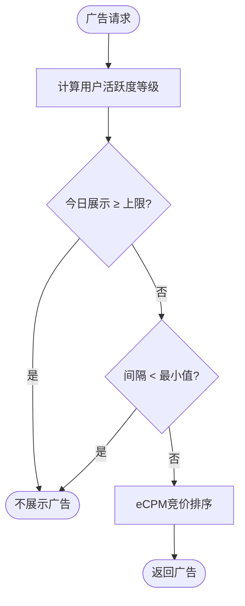

# 论文插图说明

共12张图，包含流程图（Mermaid源码，用Visio绘制）和截图（运行系统后截取）。

---

## 流程图（用Visio绘制）

### 图2-1 DeepFM模型结构图


```mermaid
graph TB
    A[输入特征] --> B[Embedding层]
    B --> C[FM层<br/>二阶交叉]
    B --> D[DNN层<br/>高阶交叉]
    C --> E[求和]
    D --> E
    E --> F[Sigmoid]
    F --> G[pCTR输出]
```

---

### 图3-1 系统用例图


```mermaid
graph LR
    subgraph 消费者
        A1[浏览商品]
        A2[搜索商品]
        A3[下单购买]
        A4[发表评价]
        A5[查看活跃度]
    end
    subgraph 商家
        B1[管理商品]
        B2[创建广告]
        B3[查看广告效果]
    end
    subgraph 管理员
        C1[查看仪表盘]
        C2[分析活跃度分布]
    end
```

---

### 图3-2 系统整体架构图


```mermaid
graph TB
    A[前端 Vue 3] -->|REST API| B[后端 FastAPI]
    B --> C[推荐引擎]
    B --> D[广告引擎]
    B --> E[活跃度引擎]
    E -->|活跃度等级| D
    B --> F[(SQLite 数据库)]
```

---

### 图3-3 推荐流程图


```mermaid
flowchart TB
    A([用户请求推荐]) --> B{有历史行为?}
    B -->|否| C[热门商品兜底]
    B -->|是| D[多路召回]
    D --> E[深度模型排序]
    E --> F[多样性重排]
    C --> G[广告混排]
    F --> G
    G --> H([返回结果])
```

---

### 图3-4 广告频控流程图


```mermaid
flowchart TB
    A([广告请求]) --> B[计算用户活跃度等级]
    B --> C{今日展示 ≥ 上限?}
    C -->|是| D([不展示广告])
    C -->|否| E{间隔 < 最小值?}
    E -->|是| D
    E -->|否| F[eCPM竞价排序]
    F --> G([返回广告])
```

---

### 图3-5 数据库E-R关系图

用Visio绘制，矩形表示实体，菱形表示关系，标注1和N。

```
    ┌──────────┐    1:N     ┌──────────┐    N:1     ┌──────────┐
    │ Category │───────────→│ Product  │←───────────│  User    │
    └──────────┘            └──────────┘  (merchant) └──────────┘
                                │                       │
                           N:1  │                       │ 1:N
                                ↓                       ↓
                          ┌──────────┐            ┌──────────┐
                          │  Review  │            │  Order   │
                          └──────────┘            └──────────┘
                                                       │ 1:N
                                                       ↓
          ┌──────────┐                           ┌──────────────┐
          │   Ad     │←── 1:N ── User            │  OrderItem   │
          └──────────┘                           └──────────────┘
               │ 1:N                                   ↑ N:1
               ↓                                  Product
         ┌──────────────┐
         │ AdImpression │←── N:1 ── User
         └──────────────┘

          ┌────────────────┐
          │ UserBehavior   │←── N:1 ── User
          └────────────────┘←── N:1 ── Product

          ┌──────────┐
          │   QA     │←── N:1 ── User, Product
          └──────────┘
```

关系说明（标在连线上）：
- Category → Product：1:N（一个分类下多个商品）
- User → Product：1:N（一个商家发布多个商品）
- User → Order：1:N（一个用户多个订单）
- Order → OrderItem：1:N（一个订单多个商品项）
- Product → OrderItem：1:N（一个商品出现在多个订单项）
- User → Review：1:N（一个用户多条评价）
- Product → Review：1:N（一个商品多条评价）
- User → Ad：1:N（一个商家多条广告）
- Ad → AdImpression：1:N（一条广告多次展示）
- User → AdImpression：1:N（一个用户多次看到广告）
- User → UserBehavior：1:N（一个用户多条行为）
- Product → UserBehavior：1:N（一个商品被多次浏览）
- User → QA：1:N（一个用户多条问答）
- Product → QA：1:N（一个商品多条问答）

注：Order与Product通过OrderItem构成N:N（多对多）关系

---

### 图4-1 活跃度评分流程图


```mermaid
flowchart TB
    A([开始]) --> B[读取用户行为记录]
    B --> C[逐条计算: 权重 × 时间衰减]
    C --> D[累加得分]
    D --> E{得分 ≥ 60?}
    E -->|是| F([高活跃])
    E -->|否| G{得分 ≥ 20?}
    G -->|是| H([普通])
    G -->|否| I([低活跃])
```

---

## 截图（运行系统后截取）

以下图片需要启动前后端系统，在浏览器中截取：

### 图4-2 系统首页界面截图
- 启动后端：`cd backend && uvicorn app.main:app --port 8000`
- 启动前端：`cd frontend && npm run dev`
- 登录账号 user_0 / user123
- 在浏览器中截取首页，包含推荐商品流和穿插的广告卡片

### 图4-3 商品详情页界面截图
- 点击任意商品进入详情页
- 截图包含：商品信息、价格、评价区域、问答区域、广告推荐区

### 图4-4 管理后台数据分析界面截图
- 登录管理员账号 admin / admin123
- 进入 /admin 页面
- 截图包含：统计卡片、活跃度饼图、广告效果排行图、频控策略图

### 图5-1 单元测试执行结果截图
- 运行：`cd backend && python -m pytest tests/ -v --tb=short`
- 截取终端输出，显示测试用例列表和 "77 passed, 4 skipped"

### 图5-2 集成测试执行结果截图
- 运行：`cd backend && python -m pytest tests/test_integration.py -v`
- 截取终端输出，显示6个集成测试全部通过

---

## 使用说明

1. 流程图：复制Mermaid代码到 https://mermaid.live/ 预览，然后在Visio中按逻辑绘制
2. 截图：启动系统后在浏览器/终端中截取，建议宽度12-14cm
3. 全部图片居中排列，图题在图片下方
4. 图序号格式："图X-Y 名称"
