# 基于社区数据反馈的电商广告推荐系统的设计与实现

## 重构说明

**原结构 → 新结构：**
- 原第1章（绪论）→ 新第1章（压缩至~3页）
- 原第2章（相关技术）→ 新第2章（压缩至~3页）
- 原第3章（需求分析）+ 原第4章（系统设计）→ 新第3章（合并）
- 原第5章（详细设计与实现）→ 新第4章（以图为主、文字为辅）
- 原第6章（测试）→ 新第5章

---

# 第1章 绪论

## 1.1 研究背景与意义

随着电子商务行业的快速发展，广告收入已成为电商平台的重要盈利来源。据统计，2024年中国电商广告市场规模已超过万亿元，广告推荐系统的效率直接影响平台的商业价值。然而，电商广告推荐面临一个核心矛盾：平台需要通过投放广告来获取收入，但过于频繁的广告展示会损害用户体验，导致用户流失。

传统的广告频控机制对所有用户采用统一的展示限制策略，忽视了不同用户对广告的容忍度差异。研究表明，高活跃用户对平台具有较强的黏性和忠诚度，其广告容忍阈值显著高于低活跃用户[14]。因此，实施差异化的广告频控策略具有重要的理论和实践意义。

本研究的核心思路是在电商平台中引入社区子系统（商品评价与问答），通过量化用户在社区中的参与行为来评估用户活跃度，并据此实施差异化的广告频控策略。这种设计形成了"社区参与→活跃度提升→广告策略优化→用户留存提升"的正向闭环，在保障用户体验的前提下最大化广告收入。

## 1.2 国内外研究现状

在推荐算法领域，协同过滤算法仍是工业界的基础方法[5]。近年来，深度学习模型在推荐系统中的应用不断深入：DeepFM模型通过融合FM层和DNN层实现了低阶与高阶特征交叉的统一建模[2]；DIN模型引入注意力机制对用户行为序列进行动态建模[1]；基于大语言模型的推荐方法也成为前沿热点[8][9]。在电商推荐领域，混合推荐架构通过多路召回与深度排序的多阶段漏斗设计已成为业界标准范式[3]。

在计算广告领域，CTR预测是广告排序的核心技术[4]。eCPM竞价机制和GSP计费模式在主流广告平台中被广泛采用。然而，现有研究在广告频控方面较少关注用户行为数据的利用，尤其是社区行为数据与广告策略之间的关联尚缺乏系统研究。

在用户行为分析领域，用户活跃度建模是平台运营的关键技术。王洪涛等[15]研究了行为权重和时间衰减在电商推荐优化中的应用；赵文婷等[14]分析了社交电商中社区互动对用户留存的影响机制。这些研究为本系统的活跃度评分模型提供了理论基础。

## 1.3 研究内容与论文结构

本文设计并实现了一个基于社区数据反馈的电商广告推荐系统，主要研究内容包括：（1）基于多路召回与深度排序的推荐引擎设计；（2）基于行为加权与时间衰减的用户活跃度评分模型；（3）基于活跃度等级的差异化广告频控机制。

论文结构安排如下：第1章为绪论；第2章介绍相关技术；第3章进行系统分析与总体设计；第4章为系统详细设计与实现；第5章为系统测试与结果分析。

---

# 第2章 相关技术

## 2.1 协同过滤推荐算法

协同过滤（Collaborative Filtering）是推荐系统中最经典的算法范式，其核心思想是利用用户群体的行为数据来预测个体用户的偏好[5]。协同过滤主要分为两类：基于用户的协同过滤（UserCF）通过计算用户之间的相似度，将相似用户喜欢的商品推荐给目标用户；基于物品的协同过滤（ItemCF）通过计算商品之间的共现相似度，推荐与用户历史行为相似的商品。两种方法的相似度计算均采用余弦相似度公式。此外，矩阵分解方法（如ALS）通过将用户-商品交互矩阵分解为低维隐因子矩阵，能够有效缓解数据稀疏性问题。

## 2.2 深度学习推荐模型

DeepFM模型由华为团队提出，将因子分解机（FM）与深度神经网络（DNN）结合，同时捕获低阶和高阶特征交叉[2]。其结构如图2-1所示，输入特征经过Embedding层后分别送入FM层和DNN层，最终通过Sigmoid函数输出点击概率预测值pCTR。DIN（Deep Interest Network）模型则针对用户行为序列建模，通过注意力机制根据候选商品动态激活用户历史中的相关兴趣，实现了用户兴趣的动态表达[1]。

## 2.3 计算广告技术

eCPM（effective Cost Per Mille）是广告排序的统一度量指标，其计算公式为eCPM = bid × pCTR × 1000（CPC模式）。广告竞价通常采用广义第二价格（GSP）机制，获胜广告主的实际扣费基于下一位竞价者的eCPM而非自身出价，从而激励广告主按真实价值出价[4]。频率控制（Frequency Capping）通过限制单个用户在一定时间内的广告曝光次数来平衡广告收入与用户体验。

## 2.4 开发技术选型

后端采用Python FastAPI框架，其基于ASGI的异步架构能够高效处理并发请求，内置的依赖注入和自动API文档生成简化了开发流程。数据持久层使用SQLAlchemy ORM配合SQLite数据库。前端采用Vue 3框架，搭配Element Plus组件库和ECharts可视化库。推荐模型基于PyTorch实现，特征工程依托scikit-learn。认证采用JWT（JSON Web Token）方案。

---

# 第3章 系统分析与总体设计

## 3.1 系统需求分析

### 3.1.1 功能需求

本系统涉及三类用户角色，各角色的功能需求如下：

（1）消费者：浏览和搜索商品、加入购物车并下单购买、发表商品评价和商品问答、查看个人活跃度评分。

（2）商家：管理自有商品（增删改查）、创建和管理广告（设置出价、预算、定向标签）、查看广告投放效果统计。

（3）管理员：查看平台运营仪表盘（用户数、订单量、收入等关键指标）、分析用户活跃度分布、监控广告投放效果。

### 3.1.2 系统用例设计

根据上述功能需求，绘制系统用例图如图3-1所示。

**图3-1 系统用例图**

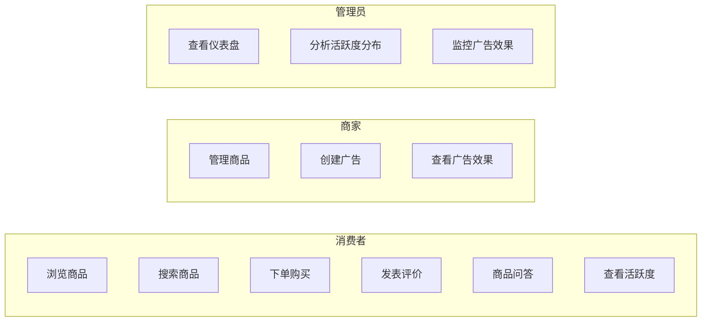

### 3.1.3 非功能需求

（1）性能需求：推荐接口响应时间小于500ms，商品列表接口响应时间小于200ms。

（2）安全需求：用户密码采用bcrypt加密存储；API接口通过JWT进行身份认证和权限控制；商家和管理员接口具有角色鉴权保护。

（3）可扩展性：推荐引擎采用流水线架构，召回和排序模块可独立替换；频控参数可配置化，支持按需调整策略。

## 3.2 系统功能结构设计

根据需求分析，将系统划分为五个功能子系统，功能结构如图3-2所示。

**图3-2 系统功能结构图**

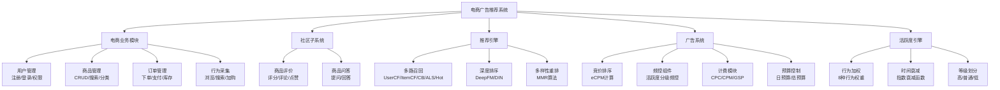

电商业务模块提供商品、订单、用户等基础功能，同时采集用户行为数据。社区子系统提供评价和问答两种交互方式。推荐引擎采用"召回→排序→重排"三阶段漏斗架构。广告系统实现竞价、频控和计费。活跃度引擎通过行为加权和时间衰减计算活跃度评分，其输出驱动频控组件的策略选择。

## 3.3 系统总体架构设计

系统采用前后端分离的单体分层架构，如图3-3所示。

**图3-3 系统整体架构图**

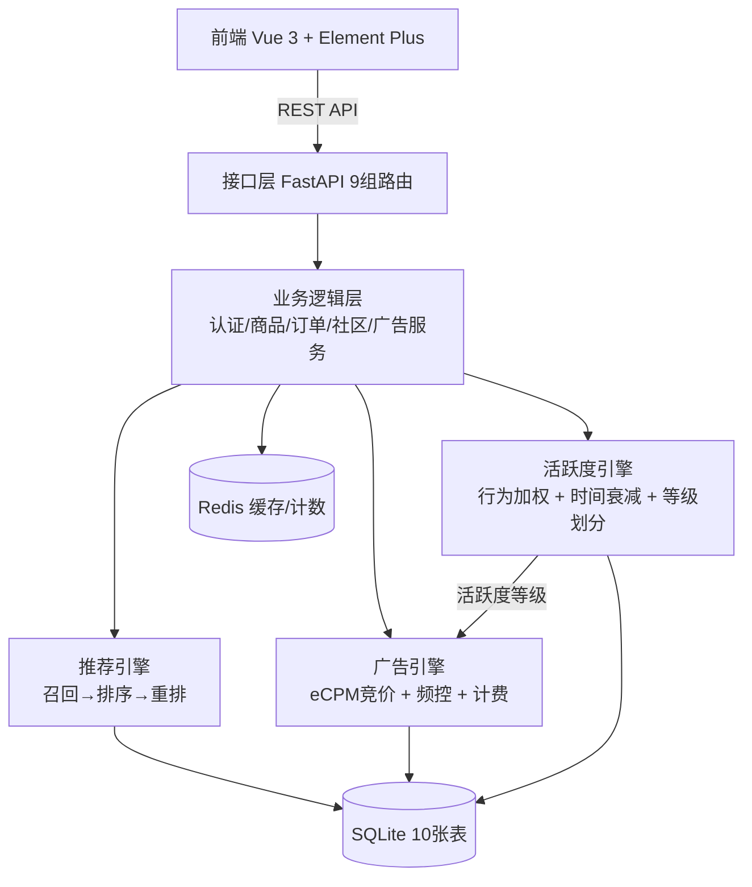

整体架构自上而下分为五层：前端展示层（Vue 3 + Element Plus，消费者端/商家端/管理后台）、接口层（FastAPI 9组路由，请求解析与参数校验）、业务逻辑层（认证/商品/订单/社区/广告五个服务模块）、引擎层（推荐引擎、广告引擎、活跃度引擎，其中活跃度引擎的输出驱动广告引擎的频控决策）、数据层（SQLite 10张业务表 + Redis缓存与实时计数）。

## 3.4 数据库设计

### 3.4.1 E-R关系设计

系统数据模型涉及7个核心实体，E-R图如图3-4所示。

**图3-4 数据库E-R关系图**

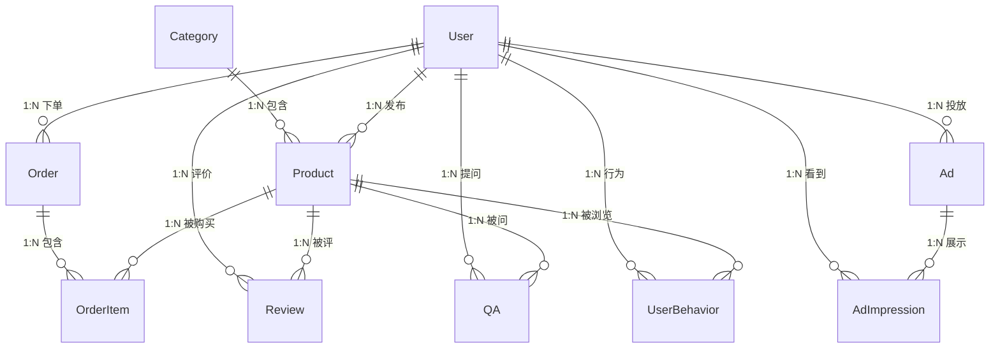

关键关系：User与Order为一对多；Order与Product通过OrderItem构成多对多；User通过Review和QA与Product产生社区交互；UserBehavior表作为推荐引擎和活跃度引擎的共同数据源。

### 3.4.2 数据库表设计

系统共设计10张核心表，主要表结构如下。

**表3-1 用户表（users）**

| 字段 | 类型 | 说明 |
|------|------|------|
| id | INTEGER PK | 自增主键 |
| username | VARCHAR(50) UNIQUE | 用户名 |
| email | VARCHAR(120) UNIQUE | 邮箱 |
| hashed_password | VARCHAR(255) | bcrypt加密密码 |
| role | VARCHAR(10) | 角色：consumer/merchant/admin |
| activity_score | REAL DEFAULT 0.0 | 活跃度评分（0-100） |
| ad_frequency_level | VARCHAR(10) DEFAULT 'normal' | 频控等级：high/normal/low |
| created_at | DATETIME | 注册时间 |
| last_active_at | DATETIME | 最后活跃时间 |

**表3-2 商品表（products）**

| 字段 | 类型 | 说明 |
|------|------|------|
| id | INTEGER PK | 自增主键 |
| name | VARCHAR(200) | 商品名称 |
| description | TEXT | 商品描述 |
| price | REAL | 价格 |
| category_id | INTEGER FK | 所属分类 |
| merchant_id | INTEGER FK | 发布商家 |
| stock | INTEGER | 库存 |
| sales_count | INTEGER DEFAULT 0 | 累计销量 |
| tags | JSON | 商品标签（推荐和广告定向用） |
| embedding | BLOB | 商品向量嵌入 |

**表3-3 广告表（ads）**

| 字段 | 类型 | 说明 |
|------|------|------|
| id | INTEGER PK | 自增主键 |
| advertiser_id | INTEGER FK | 广告主 |
| title | VARCHAR(200) | 广告标题 |
| bid_amount | REAL | 出价（CPC单次点击价/CPM千次展示价） |
| bid_type | VARCHAR(5) | 计费类型：CPC/CPM |
| daily_budget | REAL | 日预算上限 |
| total_budget | REAL | 总预算上限 |
| spent_amount | REAL DEFAULT 0.0 | 已消耗金额 |
| target_tags | JSON | 定向标签 |
| status | VARCHAR(10) | 状态：active/paused/exhausted |

**表3-4 用户行为日志表（user_behaviors）**

| 字段 | 类型 | 说明 |
|------|------|------|
| id | INTEGER PK | 自增主键 |
| user_id | INTEGER FK | 用户 |
| product_id | INTEGER FK | 关联商品（搜索/登录行为可为空） |
| behavior_type | VARCHAR(10) | 行为类型：view/click/cart/purchase/review/search/login |
| context | JSON | 行为上下文（搜索词、页面来源等） |
| created_at | DATETIME | 行为时间 |

**表3-5 广告曝光记录表（ad_impressions）**

| 字段 | 类型 | 说明 |
|------|------|------|
| id | INTEGER PK | 自增主键 |
| ad_id | INTEGER FK | 关联广告 |
| user_id | INTEGER FK | 触发用户 |
| impression_type | VARCHAR(10) | 事件类型：show/click/convert |
| context | JSON | 事件上下文 |
| created_at | DATETIME | 事件时间 |

**表3-6 商品评价表（reviews）**

| 字段 | 类型 | 说明 |
|------|------|------|
| id | INTEGER PK | 自增主键 |
| user_id | INTEGER FK | 评价用户 |
| product_id | INTEGER FK | 被评商品 |
| rating | INTEGER | 评分（1-5星） |
| content | TEXT | 评价内容 |
| helpful_count | INTEGER DEFAULT 0 | 有帮助数 |
| created_at | DATETIME | 评价时间 |

其余表（categories、orders、order_items、qa）的完整DDL详见附录。数据库共建立13个索引以优化查询性能，重点覆盖外键关联查询和时间范围查询。

---

# 第4章 系统详细设计与实现

本章以类图、时序图、流程图和数据表为主，辅以文字描述，详细阐述各模块的设计与实现。

## 4.1 推荐引擎详细设计

### 4.1.1 推荐引擎类结构

推荐引擎的核心类关系如图4-1所示。

**图4-1 推荐引擎核心类图**

```mermaid
classDiagram
    class RecommendationPipeline {
        -UserCF user_cf
        -ItemCF item_cf
        -ContentBasedRecall content_based
        -HotRecall hot
        -bool _fitted
        +fit(interaction_matrix, product_texts, product_views)
        +recommend(user_id, limit) list
    }
    class UserCF {
        -ndarray user_sim_matrix
        -ndarray interaction_matrix
        +fit(interaction_matrix)
        +recommend(user_idx, n) List~int~
    }
    class ItemCF {
        -ndarray item_sim_matrix
        -ndarray interaction_matrix
        +fit(interaction_matrix)
        +recommend(user_idx, n) List~int~
    }
    class ContentBasedRecall {
        -ndarray tfidf_matrix
        -ndarray sim_matrix
        +fit(product_texts)
        +recommend(liked_indices, n) List~int~
    }
    class ALSModel {
        -ndarray user_factors
        -ndarray item_factors
        +fit(interaction_matrix, n_components)
        +recommend(user_idx, n) List~int~
    }
    class HotRecall {
        -dict product_scores
        +update(scores)
        +recommend(n) List~int~
    }
    class DeepFMModel {
        -Embedding embeddings
        -FMLayer fm
        -Sequential dnn
        +forward(sparse_x, dense_x) Tensor
        +predict(candidates) ndarray
    }
    class DINModel {
        -Embedding item_embedding
        -AttentionLayer attention
        -Sequential dnn
        +forward(candidate_id, history_ids, mask) Tensor
        +predict(candidates) ndarray
    }
    class mmr_rerank {
        <<function>>
        +mmr_rerank(items, n, lambda_param) list
    }
    RecommendationPipeline --> UserCF : 召回
    RecommendationPipeline --> ItemCF : 召回
    RecommendationPipeline --> ContentBasedRecall : 召回
    RecommendationPipeline --> ALSModel : 召回
    RecommendationPipeline --> HotRecall : 兜底召回
    RecommendationPipeline --> DeepFMModel : 排序
    RecommendationPipeline --> DINModel : 排序
    RecommendationPipeline --> mmr_rerank : 重排
```

RecommendationPipeline作为编排器，聚合五种召回算法、两种排序模型和MMR重排函数。召回层各算法并行运行，结果合并去重后送入排序层；排序层输出pCTR分数后，由mmr_rerank保证结果多样性。

### 4.1.2 推荐流程

推荐请求的完整处理流程如图4-2所示。

**图4-2 推荐流程图**

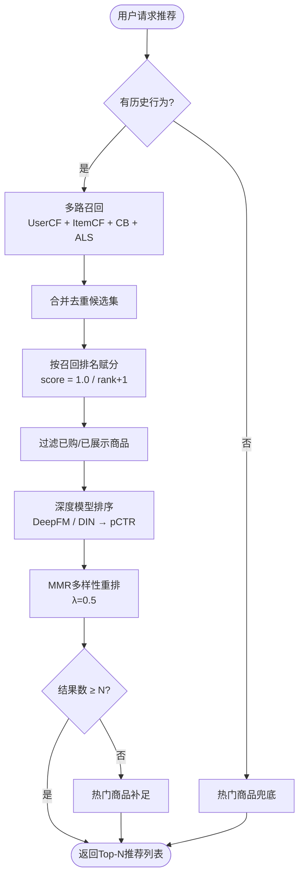

关键决策点：若用户无历史行为（冷启动），直接返回热门商品；正常流程经过召回→评分→过滤→排序→重排五个阶段；结果不足时由热门召回补足。

### 4.1.3 推荐请求时序

图4-3展示了推荐请求在各组件间的调用时序。

**图4-3 个性化推荐请求时序图**

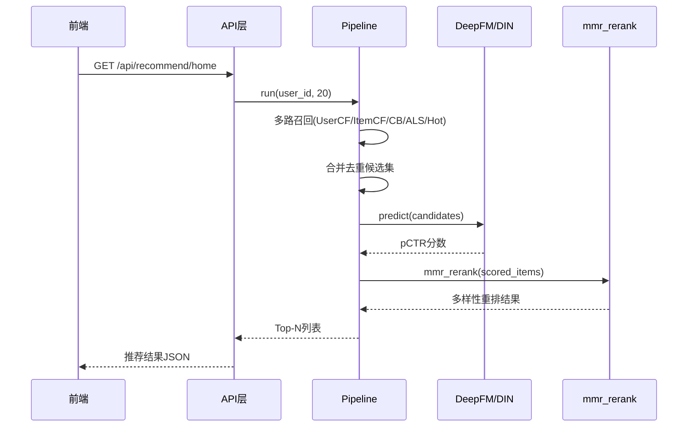

### 4.1.4 召回算法对比

五种召回算法的特性对比如表4-1所示。

**表4-1 召回算法特性对比**

| 算法 | 输入数据 | 核心公式 | 适用场景 |
|------|---------|---------|---------|
| UserCF | 用户-商品评分矩阵 | score(u,i) = Σ sim(u,v) × r(v,i) | 发现相似用户的偏好 |
| ItemCF | 商品-用户共现矩阵 | score(u,i) = Σ r(u,j) × sim(i,j) | 发现相似商品 |
| ContentBased | 商品文本TF-IDF向量 | score(i) = mean(sim(i,j)) j∈liked | 缓解冷启动 |
| ALS/NMF | 用户-商品矩阵 | R ≈ W × H，r̂(u,i) = w_u · h_i | 发现潜在兴趣 |
| HotRecall | 商品销量/浏览量 | 按全局热度排序 | 新用户兜底 |

UserCF和ItemCF的相似度矩阵均通过cosine_similarity计算，对角线置零排除自身。隐式评分采用浏览=1分、购买=5分。ContentBased使用TfidfVectorizer向量化商品标签和描述文本。

### 4.1.5 DeepFM排序模型结构

DeepFM模型的网络结构如图4-4所示。

**图4-4 DeepFM模型结构图**

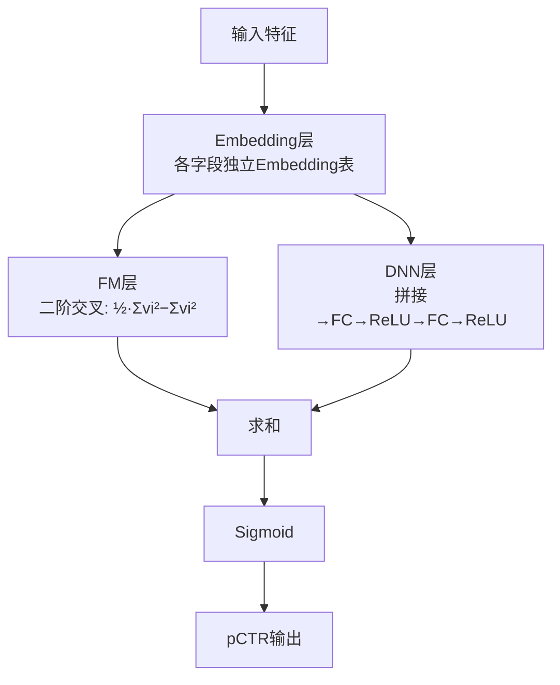

模型接收两类输入：稀疏特征（用户ID、商品ID、品类ID等，经Embedding映射为稠密向量）和连续特征（价格、销量、评分均值等）。FM层通过公式 $y_{FM}=\frac{1}{2}[(\sum v_i)^2 - \sum v_i^2]$ 计算二阶特征交叉，时间复杂度O(n)。DNN层将嵌入向量拼接后通过多层全连接网络捕获高阶交叉。最终输出 $\hat{y} = \sigma(y_{FM} + y_{DNN})$。

### 4.1.6 DIN排序模型结构

DIN模型的注意力机制结构如图4-5所示。

**图4-5 DIN注意力机制结构图**

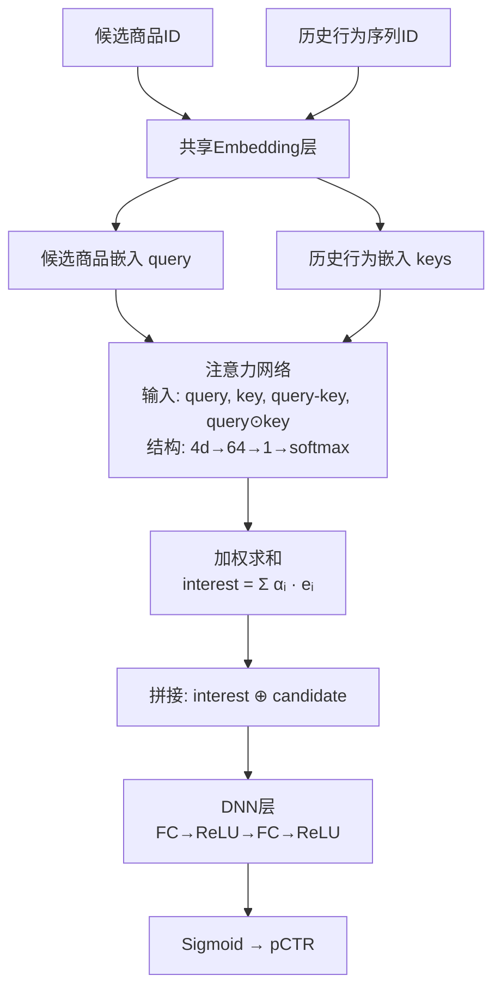

DIN通过注意力机制根据候选商品动态激活用户历史中的相关兴趣。注意力网络输入为[query, key, query−key, query⊙key]四元组拼接，支持序列掩码处理不等长行为序列。不同候选商品激活不同的历史兴趣点，实现"一物一策"。

### 4.1.7 MMR重排算法

MMR选择公式为：$\text{MMR}(i) = \lambda \cdot \text{rel}(i) - (1-\lambda) \cdot \max_{j \in S} \text{sim}(i,j)$，其中λ=0.5。sim(i,j)基于品类二值相似度（同品类=1，不同=0）。算法贪心迭代选取MMR最高项，平衡相关性与品类多样性。

## 4.2 广告引擎详细设计

### 4.2.1 广告引擎类结构

广告引擎的核心类关系如图4-6所示。

**图4-6 广告引擎类图**

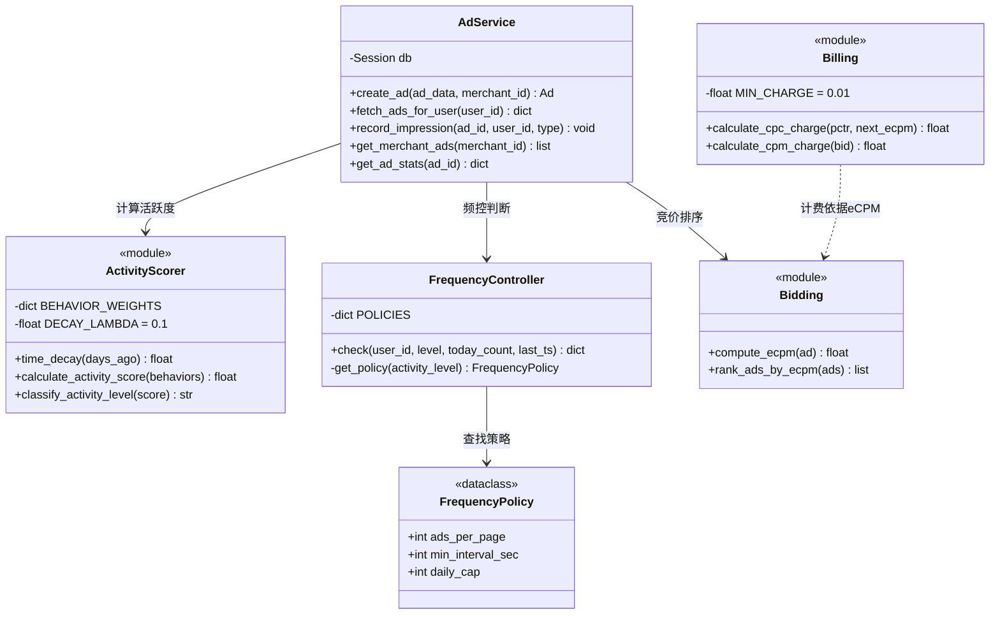

AdService作为入口，依次调用ActivityScorer（计算活跃度等级）→ FrequencyController（频控决策）→ Bidding（eCPM竞价排序）。Billing模块在展示/点击事件发生时按GSP规则计费。

### 4.2.2 广告获取时序

用户请求广告的完整时序如图4-7所示。

**图4-7 广告获取接口时序图**

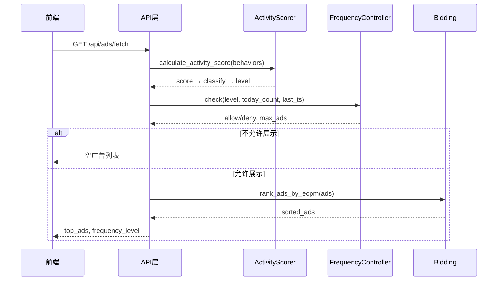

### 4.2.3 eCPM竞价与GSP计费

**表4-2 eCPM计算规则**

| 计费模式 | eCPM公式 | 说明 |
|---------|---------|------|
| CPM | eCPM = bid_amount | 出价即千次展示价 |
| CPC | eCPM = bid_amount × pCTR × 1000 | 出价×预估点击率×1000 |

**表4-3 GSP扣费规则**

| 计费模式 | 扣费公式 | 最低扣费 |
|---------|---------|---------|
| CPC（点击扣费） | charge = next_eCPM / (current_pCTR × 1000) + 0.01 | 0.01元 |
| CPM（展示扣费） | charge = bid_amount / 1000 | — |

GSP机制保证获胜广告主的实际扣费基于下一位竞价者的eCPM，而非自身出价。

### 4.2.4 预算控制流程

**图4-8 预算控制流程图**

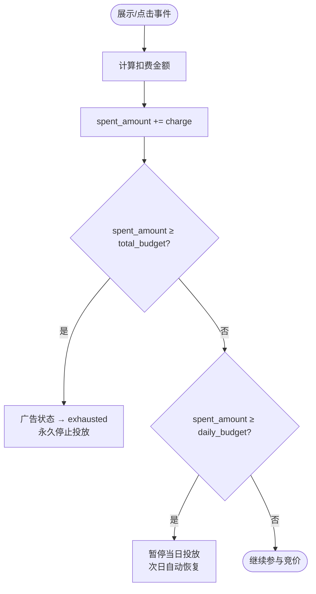

## 4.3 活跃度引擎详细设计

### 4.3.1 活跃度评分流程

评分计算流程如图4-9所示。

**图4-9 活跃度评分流程图**

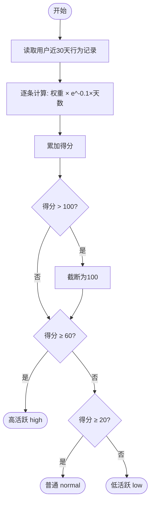

### 4.3.2 行为权重表

**表4-4 行为权重配置**

| 行为类型 | 权重 | 来源 | 设计依据 |
|---------|------|------|---------|
| purchase（购买） | 10 | 电商 | 最强交易意图 |
| review（评价） | 5 | 社区 | 激励社区参与 |
| answer（回答） | 5 | 社区 | 激励社区参与 |
| cart（加购） | 3 | 电商 | 较强购买意向 |
| login（登录） | 2 | 电商 | 基础活跃信号 |
| helpful（点赞） | 2 | 社区 | 轻量社区互动 |
| view（浏览） | 1 | 电商 | 最基础行为 |
| search（搜索） | 1 | 电商 | 最基础行为 |

社区行为权重显著高于同等级电商行为（评价5 vs 浏览1），构成社区参与的正向激励。

### 4.3.3 时间衰减函数

公式：$\text{decay}(t) = e^{-0.1 \times t}$，t为距今天数。

**表4-5 时间衰减函数值**

| 距今天数 | 衰减系数 | 权重保留 |
|---------|---------|---------|
| 0（今天） | 1.000 | 100% |
| 3天 | 0.741 | 74% |
| 7天 | 0.497 | 50% |
| 14天 | 0.247 | 25% |
| 30天 | 0.050 | 5% |

完整评分公式：$S = \min(100, \sum_{i=1}^{N} w_i \times e^{-0.1 \times t_i})$。

### 4.3.4 等级划分与典型用户验证

**表4-6 活跃度等级划分**

| 得分范围 | 等级 | 典型用户画像 | 估算得分 |
|---------|------|------------|---------|
| ≥ 60 | high | 每天登录+浏览10商品 | (2+10)×Σdecay ≈ 79分 |
| 20~59 | normal | 每周登录2次+偶尔浏览 | ≈ 25分 |
| < 20 | low | 每周登录1次+浏览几个 | ≈ 15分 |

用户停止活跃后评分自然衰减：7天衰减约50%，14天约75%。系统每次请求实时计算，等级变化即时响应。

## 4.4 频控组件详细设计

### 4.4.1 频控判断流程

**图4-10 广告频控流程图**

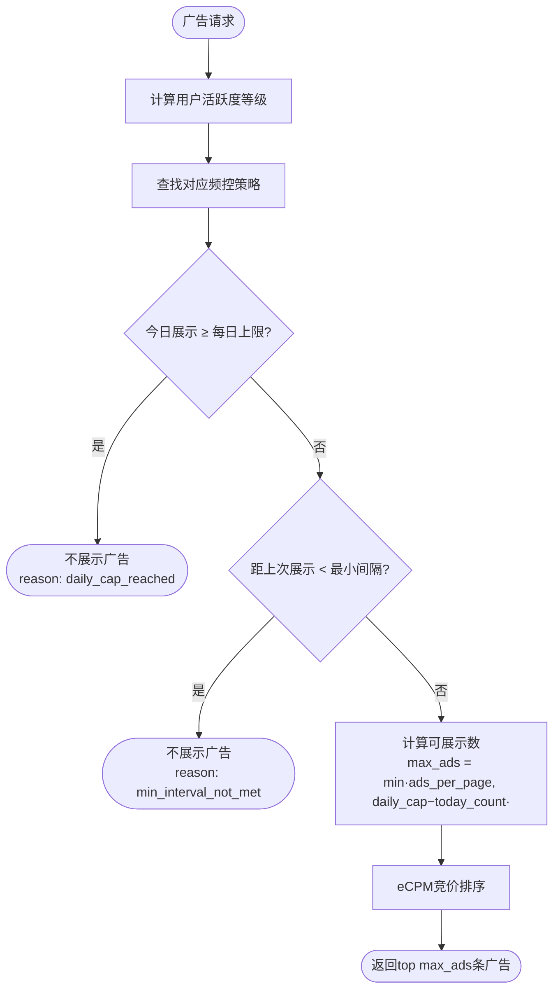

### 4.4.2 频控策略矩阵

**表4-7 三级频控策略矩阵**

| 活跃度等级 | ads_per_page | min_interval_sec | daily_cap | 设计原则 |
|-----------|-------------|-----------------|-----------|---------|
| high（≥60分） | 3 | 60 | 50 | 忠诚度高，可多展示以提升收入 |
| normal（20-59分） | 2 | 120 | 30 | 标准策略，平衡收入与体验 |
| low（<20分） | 1 | 300 | 10 | 流失风险高，减少打扰保留存 |

### 4.4.3 Redis计数器设计

**表4-8 频控相关Redis Key设计**

| Key模式 | 类型 | 说明 | TTL |
|---------|------|------|-----|
| user:{uid}:activity | String | 活跃度得分缓存 | 2小时 |
| user:{uid}:freq_level | String | 频控等级缓存 | 2小时 |
| user:{uid}:ad_count:{date} | String | 今日广告展示计数 | 到次日零点 |
| user:{uid}:ad_last | String | 上次广告展示时间戳 | 1小时 |

活跃度和频控等级缓存2小时避免重复计算。展示计数按日期Key存储，自动按日重置。

## 4.5 行为追踪与活跃度反馈

### 4.5.1 完整数据处理流程

**图4-11 数据处理流程图**

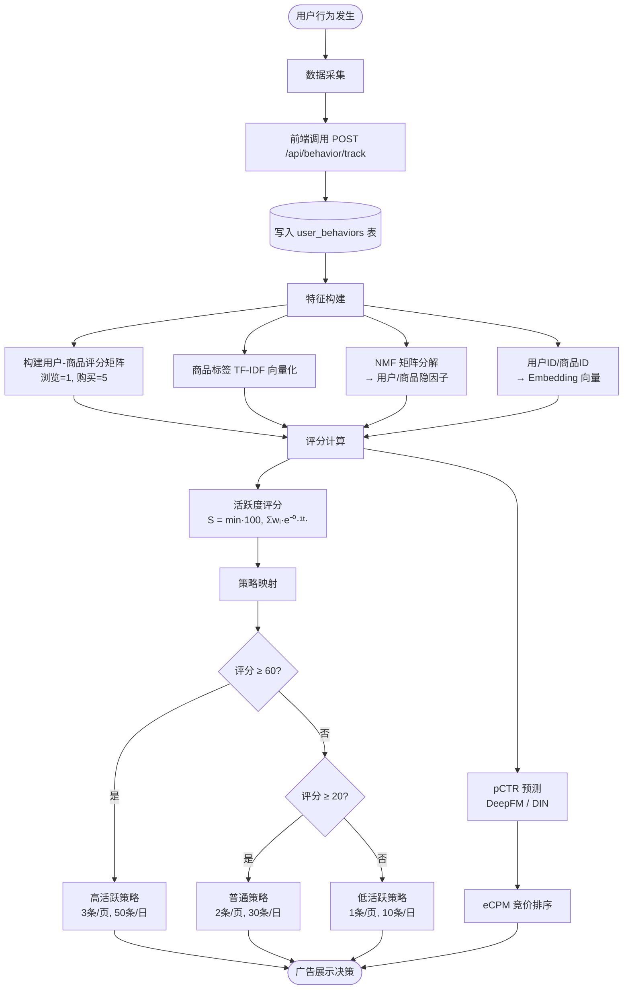

### 4.5.2 行为追踪与活跃度反馈时序

**图4-12 行为追踪与活跃度反馈时序图**

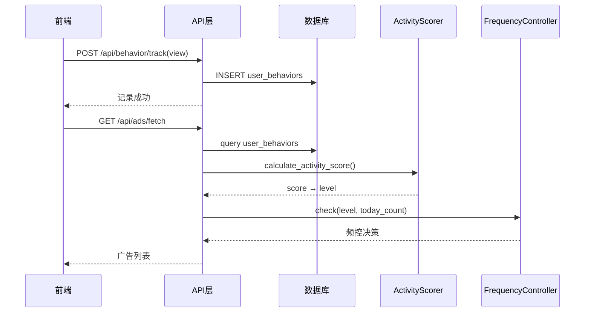

用户每次行为（浏览、搜索、评价等）实时写入行为日志表；下次广告请求时，ActivityScorer从行为日志中实时计算活跃度评分，FrequencyController据此做出频控决策。

## 4.6 社区子系统详细设计

### 4.6.1 社区子系统类结构

**图4-13 社区子系统类图**

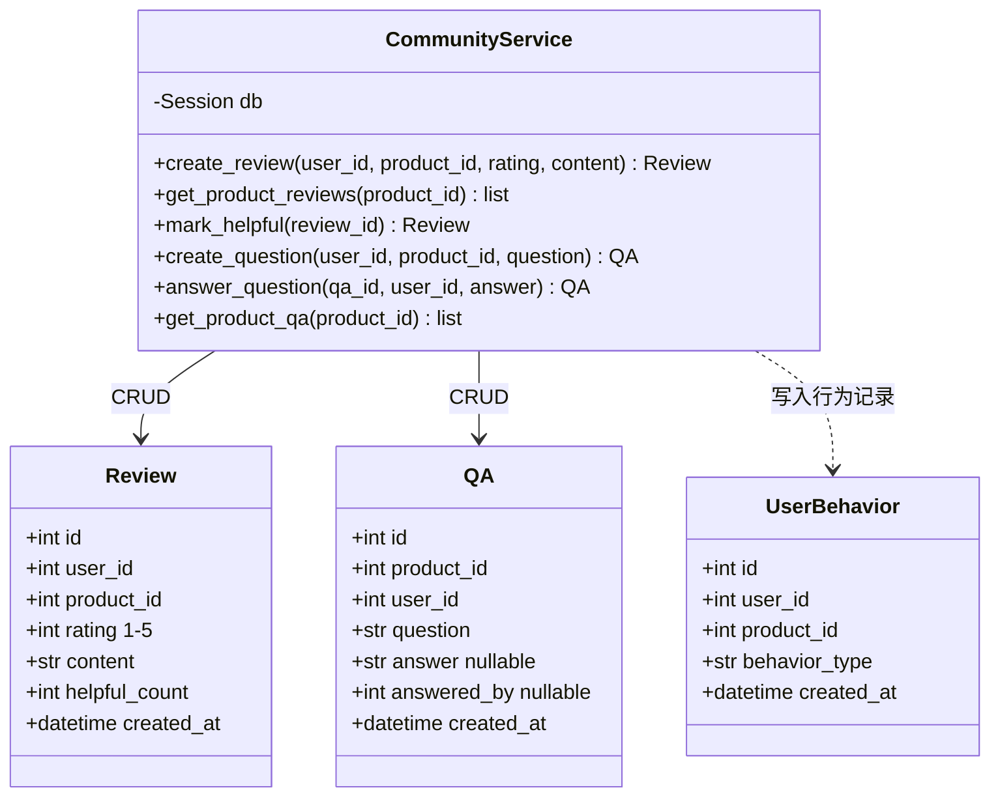

CommunityService在创建评价时自动生成behavior_type=review的行为记录（权重+5），点赞时生成behavior_type=helpful的记录（权重+2），从而驱动活跃度评分更新。这是社区数据反馈到广告频控的核心联动机制。

## 4.7 接口层详细设计

### 4.7.1 认证鉴权时序

**图4-14 JWT认证与角色鉴权时序图**

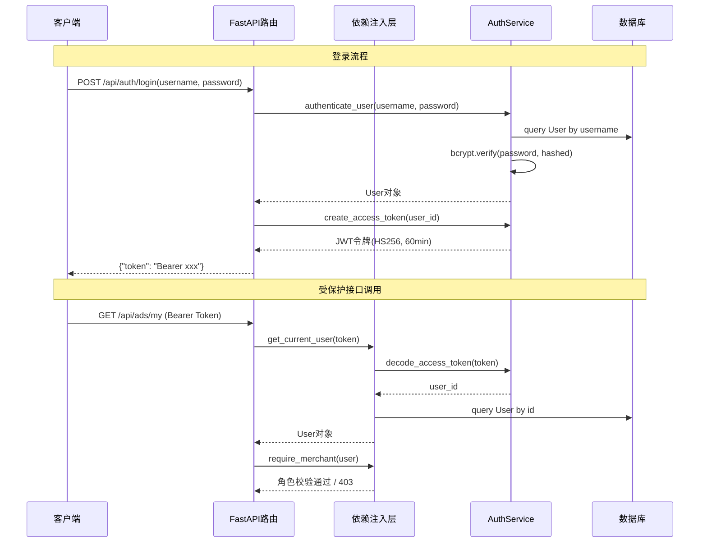

系统实现三层权限控制：get_current_user解析JWT获取用户身份；require_merchant校验商家或管理员角色；require_admin校验管理员角色。

### 4.7.2 API接口总览

**表4-9 系统API接口设计**

| 路由组 | 方法 | 路径 | 功能 | 权限 |
|-------|------|------|------|------|
| 认证 | POST | /api/auth/register | 用户注册 | 公开 |
| 认证 | POST | /api/auth/login | 用户登录 | 公开 |
| 认证 | GET | /api/auth/me | 当前用户信息 | 登录 |
| 商品 | POST | /api/products | 创建商品 | 商家 |
| 商品 | GET | /api/products | 商品列表（分页） | 公开 |
| 商品 | GET | /api/products/search | 搜索（关键词+分类+价格） | 公开 |
| 商品 | GET | /api/products/{id} | 商品详情 | 公开 |
| 商品 | PUT | /api/products/{id} | 更新商品 | 商家 |
| 订单 | POST | /api/orders | 创建订单 | 登录 |
| 订单 | GET | /api/orders | 我的订单列表 | 登录 |
| 订单 | GET | /api/orders/{id} | 订单详情 | 登录 |
| 社区 | POST | /api/reviews | 发表评价 | 登录 |
| 社区 | GET | /api/reviews/product/{id} | 商品评价列表 | 公开 |
| 社区 | POST | /api/reviews/{id}/helpful | 点赞评价 | 登录 |
| 社区 | POST | /api/qa | 提问 | 登录 |
| 社区 | GET | /api/qa/product/{id} | 商品问答列表 | 公开 |
| 社区 | POST | /api/qa/{id}/answer | 回答问题 | 登录 |
| 行为 | POST | /api/behavior/track | 上报用户行为 | 登录 |
| 广告 | POST | /api/ads | 创建广告 | 商家 |
| 广告 | GET | /api/ads/fetch | 获取广告（含频控） | 登录 |
| 广告 | POST | /api/ads/impression | 上报展示/点击/转化 | 登录 |
| 广告 | GET | /api/ads/my | 我的广告列表 | 商家 |
| 广告 | GET | /api/ads/{id}/stats | 广告效果统计 | 商家 |
| 活跃度 | GET | /api/activity/my-score | 我的活跃度 | 登录 |
| 推荐 | GET | /api/recommend/home | 首页推荐 | 公开 |
| 推荐 | GET | /api/recommend/similar/{id} | 相似商品 | 公开 |
| 推荐 | GET | /api/recommend/for-you | 猜你喜欢 | 登录 |
| 分析 | GET | /api/analytics/dashboard | 平台KPI | 管理员 |
| 分析 | GET | /api/analytics/activity-dist | 活跃度分布 | 管理员 |
| 分析 | GET | /api/analytics/ad-performance | 广告效果 | 管理员 |

## 4.8 前端界面设计

### 4.8.1 前端组件结构

**图4-15 前端组件结构图**

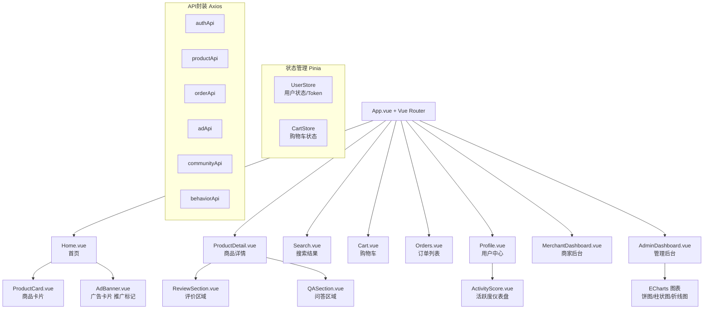

### 4.8.2 首页广告混排设计

首页采用瀑布流布局，广告以"推广"角标的原生广告形式穿插在推荐流中。混排规则：每3个推荐商品后插入1条广告（受频控max_ads限制）。广告卡片与商品卡片视觉风格一致，提升点击率。广告展示时触发show事件上报，点击时触发click事件上报并跳转。

### 4.8.3 管理后台可视化

AdminDashboard集成ECharts提供四个可视化面板：

**表4-10 管理后台可视化面板**

| 面板 | 图表类型 | 数据来源接口 | 展示内容 |
|------|---------|------------|---------|
| KPI统计卡片 | 数值卡片 | /api/analytics/dashboard | 用户数、商品数、订单数、总收入 |
| 活跃度分布 | 饼图 | /api/analytics/activity-dist | 高/普通/低活跃用户占比 |
| 广告效果排行 | 柱状图 | /api/analytics/ad-performance | 各广告CTR和消耗排名 |
| 频控效果 | 对比图 | /api/analytics/dashboard | 各等级用户广告展示量与留存率 |

---

# 第5章 系统测试

## 5.1 测试环境

**表5-1 测试环境配置**

| 项目 | 配置 |
|------|------|
| 操作系统 | Windows 11 |
| Python | 3.11 |
| 测试框架 | pytest + httpx |
| 数据库 | SQLite（内存模式） |
| 种子数据 | 1000件商品、100个用户、12000条行为记录 |

## 5.2 单元测试

系统共编写48个单元测试用例，覆盖四个核心模块：

**表5-2 单元测试用例分布**

| 模块 | 用例数 | 重点验证项 |
|------|--------|-----------|
| 推荐算法 | 18 | UserCF/ItemCF相似度计算、TF-IDF向量化、NMF收敛性、DeepFM/DIN前向传播、Pipeline数据流 |
| 活跃度引擎 | 12 | 评分公式正确性、时间衰减函数值、边界值（19.9→low, 20.0→normal, 60.0→high）、100分截断 |
| 频控组件 | 10 | 各等级参数映射、日上限deny、最小间隔deny、正常允许返回max_ads |
| 广告系统 | 8 | eCPM计算（CPC/CPM）、GSP扣费、预算耗尽状态转换 |

## 5.3 API测试

共编写21个API测试用例，覆盖正常和异常场景：

**表5-3 API测试用例分布**

| 接口组 | 用例数 | 测试要点 |
|--------|--------|---------|
| 认证 | 5 | 注册成功、重复用户名、登录成功、错误密码、无Token返回401 |
| 商品 | 4 | 创建（商家权限）、列表分页、搜索过滤、详情查询 |
| 订单 | 3 | 创建扣库存、库存不足400、非本人订单403 |
| 社区 | 5 | 创建评价、评分校验、点赞、提问、回答 |
| 广告 | 4 | 创建广告、获取（频控验证）、上报展示、上报点击 |

## 5.4 集成测试

共编写6个端到端集成测试用例：

**表5-4 集成测试用例**

| 编号 | 测试场景 | 验证链路 |
|------|---------|---------|
| IT-1 | 购买流程 | 浏览→加购→下单→库存扣减→行为记录生成 |
| IT-2 | 社区互动 | 用户评价→活跃度更新→频控等级变化 |
| IT-3 | 广告频控 | 低活跃→展示受限→参与社区→活跃度提升→展示量增加 |
| IT-4 | 推荐冷启动 | 新用户→热门兜底→产生行为→协同过滤生效 |
| IT-5 | 广告计费 | 展示→点击→GSP扣费→预算耗尽→停止投放 |
| IT-6 | 后台数据 | 多用户行为→KPI统计→活跃度分布→广告效果汇总 |

## 5.5 性能测试

**表5-5 性能测试结果**

| 接口 | 数据规模 | 响应时间 | 设计目标 | 结果 |
|------|---------|---------|---------|------|
| 推荐接口 | 1000商品/100用户/12000行为 | <500ms | <500ms | 通过 |
| 商品列表 | 1000商品分页 | <200ms | <200ms | 通过 |

## 5.6 测试结果分析

全部77个测试用例执行结果：77 passed、4 skipped。跳过的4个用例为依赖Redis连接的频控计数器测试（无Redis环境下自动跳过，不影响核心逻辑验证）。测试结果表明系统各模块的核心算法和业务逻辑实现正确，接口层的请求处理和权限控制符合设计要求。

---

# 总结与展望

本文设计并实现了一个基于社区数据反馈的电商广告推荐系统，主要贡献包括三个方面：

第一，社区驱动的频控机制。将社区行为数据引入广告频控决策，通过量化用户的评价、问答、点赞等社区参与行为来评估活跃度，这是区别于传统统一阈值频控方法的核心创新。

第二，差异化广告策略。基于活跃度评分的三级频控策略矩阵，对高活跃、普通和低活跃用户分别设定不同的每页广告数、最小展示间隔和每日上限，实现了精细化的广告展示控制。

第三，正向激励闭环。社区行为在活跃度计算中的高权重设计，形成了"社区参与→活跃度提升→广告策略优化→用户留存提升"的正向循环，将用户体验保障和商业化目标统一起来。

系统的不足之处和未来改进方向：推荐模型缺乏在线学习能力，频控参数基于经验设定而非自动优化，未来可引入强化学习自动搜索最优频控参数，并使用A/B测试框架对策略效果进行持续评估和迭代。
